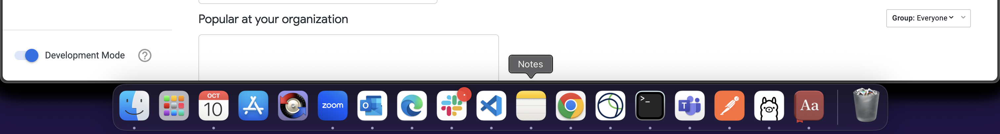

## ☎️ HelpDesk(If faced any issue post Error Here): https://t.me/+1OrvGuPgJCc2NzVl

## 📋 70+ Easiest Skill Badge Solution Sheet (Do One lab and earn skill badge) [📄 View Google Sheet](https://docs.google.com/spreadsheets/d/1UY1yh_xCRGealyBqSAejjkBSdgjqEj5M_XIQmveGJnU/edit?gid=0#gid=0)


## 🔗 Let’s Connect 👤 **LinkedIn**: [Prakash Seervi](https://www.linkedin.com/in/prakashseervi63/)


---

## 📋 70+ Easiest Skill Badge Solution Sheet (Do One lab and earn skill badge) [📄 View Google Sheet](https://docs.google.com/spreadsheets/d/1UY1yh_xCRGealyBqSAejjkBSdgjqEj5M_XIQmveGJnU/edit?gid=0#gid=0)

## 📋 70+ Pre-Assessment Skills Badges Playlist (Do One lab and earn skill badge): https://www.youtube.com/playlist?list=PLmVadbiKSEQRL5w8KSBgz2JgTrw3gzrdq


---

## Make Sure to Turn on Deveoper Mode On Home page it will show
()

Watch this Video : (main1.mov)


## Create a new view named ``users_region`` and Paste the following:

```
view: users_region {
  sql_table_name: cloud-training-demos.looker_ecomm.users ;;
  
  dimension: id {
    type: number
    sql: ${TABLE}.id ;;
    primary_key: yes
  }
  
  dimension: state {
    type: string
    sql: ${TABLE}.state ;;
  }
  
  dimension: country {
    type: string
    sql: ${TABLE}.country ;;
  }
  
  measure: count {
    type: count
    drill_fields: [id, state, country]
  }
}
```


## Replace the follwing in `training_ecommerce.model` file:

```
connection: "bigquery_public_data_looker"

# include all the views
include: "/views/*.view"
include: "/z_tests/*.lkml"
include: "/**/*.dashboard"

datagroup: training_ecommerce_default_datagroup {
  # sql_trigger: SELECT MAX(id) FROM etl_log;;
  max_cache_age: "1 hour"
}

persist_with: training_ecommerce_default_datagroup

label: "E-Commerce Training"

explore: order_items {
  join: users {
    type: left_outer
    sql_on: ${order_items.user_id} = ${users.id} ;;
    relationship: many_to_one
  }

  join: inventory_items {
    type: left_outer
    sql_on: ${order_items.inventory_item_id} = ${inventory_items.id} ;;
    relationship: many_to_one
  }

  join: products {
    type: left_outer
    sql_on: ${inventory_items.product_id} = ${products.id} ;;
    relationship: many_to_one
  }

  join: distribution_centers {
    type: left_outer
    sql_on: ${products.distribution_center_id} = ${distribution_centers.id} ;;
    relationship: many_to_one
  }
}

explore: events {
  join: event_session_facts {
    type: left_outer
    sql_on: ${events.session_id} = ${event_session_facts.session_id} ;;
    relationship: many_to_one
  }
  join: event_session_funnel {
    type: left_outer
    sql_on: ${events.session_id} = ${event_session_funnel.session_id} ;;
    relationship: many_to_one
  }
  join: users {
    type: left_outer
    sql_on: ${events.user_id} = ${users.id} ;;
    relationship: many_to_one
  }
  join: users_region {
    type: left_outer
    sql_on: ${events.user_id} = ${users_region.id};;
    relationship: many_to_one
  }
}
```