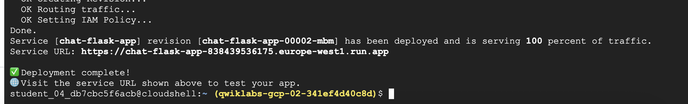
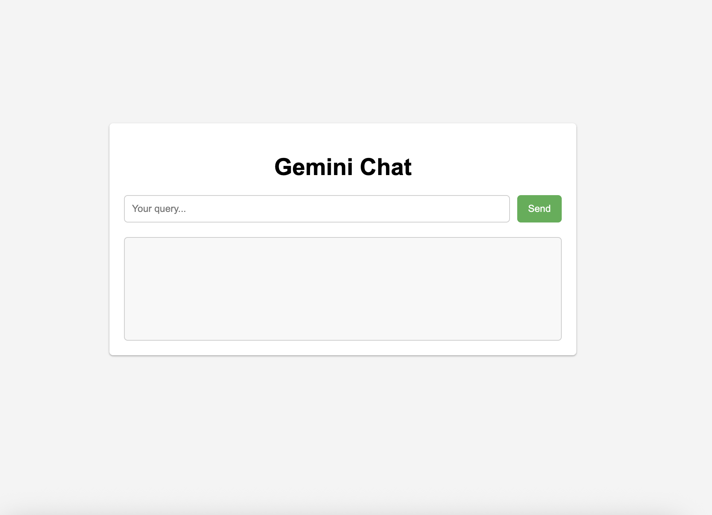

## ☎️ HelpDesk(If faced any issue post Error Here): https://t.me/+1OrvGuPgJCc2NzVl

## 📋 52 Skill Badge Solution Sheet [📄 View Google Sheet](https://docs.google.com/spreadsheets/d/1UY1yh_xCRGealyBqSAejjkBSdgjqEj5M_XIQmveGJnU/edit?gid=0#gid=0)


## 🔗 Let’s Connect 👤 **LinkedIn**: [Prakash Seervi](https://www.linkedin.com/in/prakashseervi63/)


---


STEP 1:

```
curl -LO https://raw.githubusercontent.com/pspcps/Arcade/master/GSP1201.sh

sudo chmod +x GSP1201.sh

./GSP1201.sh
```


STEP 2:

```

gcloud auth login --quiet

```

STEP3:

```
./GSP1201.sh

```


STEP4: 




Click On Service URL 


In query past : 
```
What is Google Cloud Platform?
```


and Click on Send